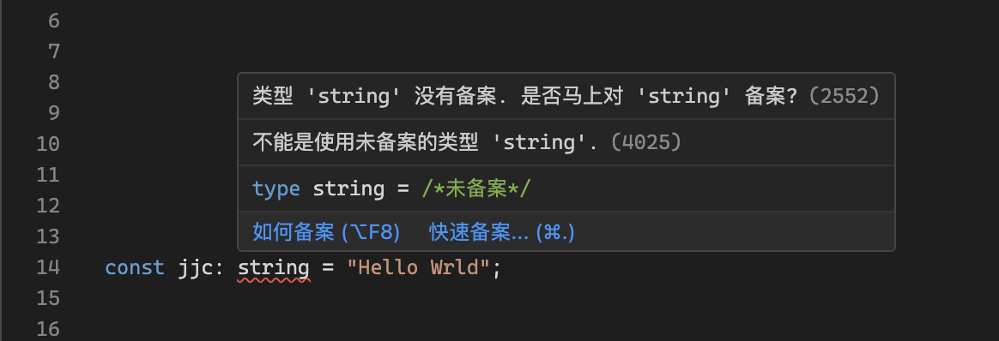

# 请备案

收集关于备案引发的梗。



## 项目介绍

### gcc

```bash
$ gcc hello.c
hello.c:4:12: error: 不得使用 printf 输出未备案字符串

    printf("Hello，world\n'):
           ^
1 error generated.
```

```bash
$ cd  
不得进入未备案的目录: /home/justjavac
```
